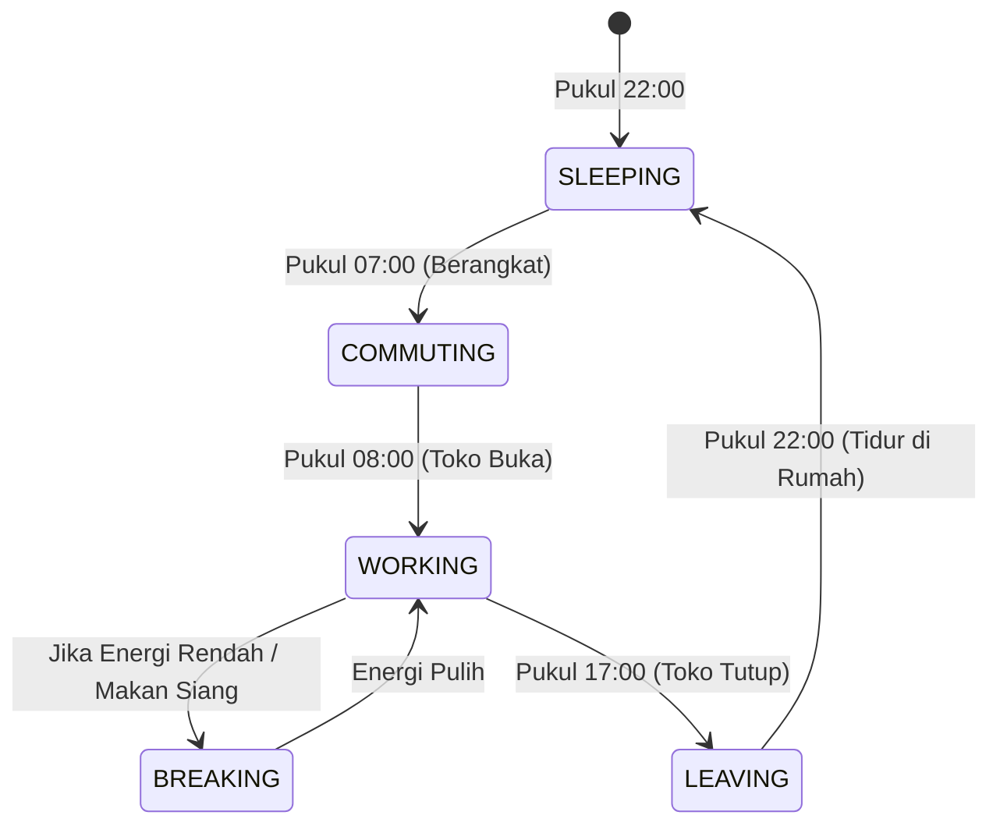

# SimCH Business — Architecture Document

Version: 2.0 (Tycoon + AI + AFK Concept Revision)  
Status: Approved

---

## 1. Struktur Folder & Modul Proyek

Proyek dirancang agar modul data karyawan, logika simulasi AI, dan scene Phaser terpisah dengan jelas.

```text
src/
├── assets/             # File gambar, audio, dan SVG
├── core/               # Konfigurasi inti dan alur scene Phaser
│   ├── config/         # Konfigurasi sistem Phaser (gameConfig.ts)
│   ├── game/           # Game Instance dan Core Manager
│   └── scenes/         # Phaser Scenes (Boot, Menu, Game, Dashboard)
├── features/           # Logika bisnis game spesifik
│   ├── employees/      # Logika AI NPC, Status Karyawan, dan Rutinitas
│   └── branches/       # Manajemen Cabang dan Keuangan Cabang
├── shared/             # Komponen yang dapat digunakan di berbagai modul
│   ├── types/          # Definisi tipe data TypeScript (game.types.ts)
│   ├── ui/             # Dashboard HTML Overlays, Grafik, dan Tabel KPI
│   └── utils/          # Fungsi utility (EventBus.ts, TimeSystem.ts, LocalStorage.ts)
├── style.css           # Styling UI dashboard dan HTML overlays
└── main.ts             # Entry point aplikasi (menginisialisasi Phaser)
```

---

## 2. Struktur Data Utama (Data Layer)

### A. Global GameState
Menyimpan data makro seluruh perusahaan:
* `cash` (number): Total kas perusahaan.
* `day` (number): Jumlah hari simulasi yang berjalan.
* `employees` (Employee[]): Daftar seluruh karyawan yang direkrut.
* `branches` (Branch[]): Daftar cabang toko yang dimiliki pemain.

### B. Objek Data Karyawan (Employee Schema)
Setiap karyawan didefinisikan oleh struktur data berikut:
```typescript
interface Employee {
  id: string;
  name: string;
  roleId: 'EMPLOYEE' | 'LEADER' | 'MANAGER' | 'UNASSIGNED';
  personality: 'DILIGENT' | 'FRIENDLY' | 'AMBITIOUS' | 'LAZY';
  skillLevel: number;
  experience: number;
  energy: number;      // 0 s.d. 100
  maxEnergy: number;
  mood: number;        // 0 s.d. 100 (mempengaruhi kinerja & risiko keluar)
  salary: number;      // Gaji harian karyawan
  currentBranchId: string | null; // Cabang tempat ditugaskan
  kpiHistory: number[]; // Riwayat efisiensi harian (0% - 100%)
  currentState: 'COMMUTING' | 'WORKING' | 'BREAKING' | 'LEAVING' | 'SLEEPING';
}
```

### C. Objek Cabang (Branch Schema)
```typescript
interface Branch {
  id: string;
  name: string;
  stock: number;
  maxStock: number;
  sellingPrice: number;
  reputation: number;       // Daya tarik cabang (0 - 100)
  managerId: string | null; // ID karyawan dengan Role MANAGER
  leaderId: string | null;  // ID karyawan dengan Role LEADER
  employeeIds: string[];    // Daftar ID karyawan dengan Role EMPLOYEE
  operationalCost: number;  // Biaya harian cabang
  dailyRevenueHistory: number[];
}
```

---

## 3. Logika Simulasi AI NPC (Rutinitas Harian)

Siklus rutinitas harian NPC digerakkan oleh modul terpusat `TimeSystem`. Perubahan status (state) NPC akan mempengaruhi visualisasi di dalam game:



Setiap perubahan state NPC memicu pembaruan logika:
* **WORKING**: Karyawan akan bergerak ke stasiun kerja mereka (kasir atau rak stok) dan memproses tugas. Kecepatan kerja dihitung dari formula:
  $$\text{Kecepatan Transaksi} = \text{Base Speed} \times \text{Skill Level} \times \left( \frac{\text{Energy}}{100} \right) \times \text{Personality Modifier}$$
* **BREAKING**: NPC berjalan ke area istirahat. Energi mereka akan memulih perlahan (+5% per detik game).
* **SLEEPING**: Energi memulih instan ke 100% pada pergantian hari.

---

## 4. Sistem AFK & Background Simulation

Saat pemain meninggalkan game (game ditutup/offline), sistem akan mencatat waktu keluar (`exitTimestamp`). Ketika game dibuka kembali, game menghitung waktu offline dan memproses simulasi latar belakang:

1. **Hitung Selisih Waktu**:
   $$\text{Waktu Offline (Detik)} = \text{Timestamp Sekarang} - \text{Timestamp Keluar}$$
2. **Konversi ke Hari Game**:
   $$\text{Hari Terlewati} = \text{Math.floor}\left( \frac{\text{Waktu Offline}}{\text{Durasi 1 Hari Game}} \right)$$
3. **Simulasi Pendapatan & Pengeluaran**:
   Untuk setiap hari yang terlewati, sistem mensimulasikan hasil operasional tiap cabang berdasarkan formula performa Manager dan Karyawan di cabang tersebut:
   $$\text{Pendapatan Cabang} = \text{Jumlah Pelanggan} \times \text{Tingkat Sukses Beli} \times \text{Harga Jual}$$
   $$\text{Biaya Cabang} = \text{Biaya Operasional} + \sum \text{Gaji Staf Cabang}$$
   $$\text{Net Profit} = \text{Pendapatan Cabang} - \text{Biaya Cabang}$$
4. **Pembatasan AFK**: Batas simulasi offline maksimal diatur selama **24 jam** (waktu nyata) untuk mencegah pemain mengeksploitasi game secara berlebihan tanpa pengawasan manajemen.

---

## 5. Komunikasi EventBus Baru
* `EVENT_EMPLOYEE_HIRED`: Dipicu saat merekrut staf baru.
* `EVENT_EMPLOYEE_ASSIGNED`: Dipicu saat menugaskan staf ke suatu cabang.
* `EVENT_BRANCH_CREATED`: Dipicu saat membuka cabang baru.
* `EVENT_KPI_UPDATED`: Dipicu di akhir hari setelah evaluasi kinerja selesai.
* `EVENT_AUTO_ORDER_TRIGGERED`: Dipicu ketika Manager AI memesan stok secara otomatis.
