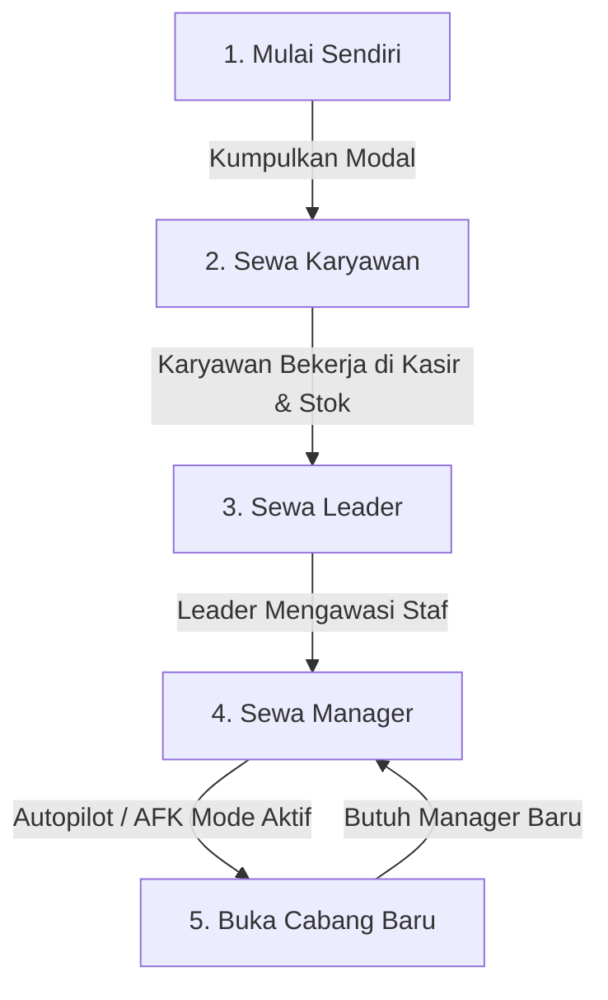
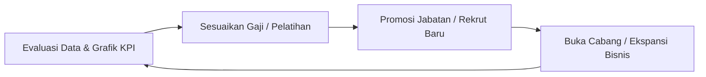

# SimCH Business — Game Design Document (GDD)

Version: 2.0 (Tycoon + AI + AFK Concept Revision)  
Status: Approved

---

## 1. Ringkasan Game (Game Overview)

**SimCH Business** adalah game simulasi strategi manajemen bisnis, tycoon, AI, dan AFK. Pemain berperan sebagai CEO/Pemilik Bisnis. Berbeda dengan game simulasi toko biasa di mana pemain mengatur stok dan harga secara manual, di game ini pemain fokus pada **manajemen data bisnis dan manajemen SDM (karyawan)**, sementara strategi operasional harian diserahkan sepenuhnya kepada **AI NPC** yang disewa.

---

## 2. Alur Progres Game (Gameplay Progression Loop)

Progres permainan dirancang dari pengelolaan mandiri mikro hingga manajemen cabang berskala makro:

1. **Fase Mandiri (Self-Managed)**: Di awal permainan, pemain mengoperasikan 1 toko sendiri (membeli stok, melayani kasir, membersihkan toko).
2. **Fase Tycoon (Sewa Karyawan)**: Pemain memiliki cukup uang untuk merekrut **Karyawan**. Pemain mulai terbebas dari tugas fisik dan beralih ke peran manajemen.
3. **Fase Delegasi (Sewa Leader)**: Pemain merekrut **Leader** untuk mengawasi karyawan, menjaga moral staf, dan menangani komplain pelanggan.
4. **Fase Autopilot & AFK (Sewa Manager)**: Pemain merekrut **Manager**. Manager mengambil alih tugas penetapan harga jual dan pemesanan stok otomatis. Toko berjalan 100% otomatis (AFK Mode).
5. **Fase Ekspansi Cabang (Branch Expansion)**: Pemain membuka cabang toko baru. Setiap cabang baru **wajib** dipimpin oleh seorang Manager AI agar bisa beroperasi. Pemain hanya fokus memantau laporan analitik seluruh cabang.

---

## 3. Sistem Karyawan AI & Role ID

Setiap NPC yang disewa memiliki **Role ID** spesifik, Kepribadian (Personality), Status (Stats), dan Rutinitas Harian (Daily Routine).

### A. Role ID & Tanggung Jawab
* **Karyawan (Role ID: `EMPLOYEE`)**:
  * Fokus pada pekerjaan fisik: Mengisi rak barang, melayani transaksi kasir, dan menjaga kebersihan toko.
* **Pemimpin (Role ID: `LEADER`)**:
  * Mengawasi kinerja Karyawan di satu cabang toko.
  * Meningkatkan motivasi staf terdekat (+boost kecepatan kerja karyawan).
  * Menangani komplain pelanggan (mengembalikan reputasi toko yang hilang akibat pelayanan buruk).
* **Manajer (Role ID: `MANAGER`)**:
  * Mengambil keputusan strategi bisnis cabang toko.
  * Melakukan pembelian stok otomatis (*Auto-Ordering*) saat stok menipis berdasarkan perkiraan penjualan harian.
  * Mengatur harga jual (*Auto-Pricing*) berdasarkan dinamika pasar lokal untuk memaksimalkan keuntungan atau meningkatkan reputasi.

### B. Atribut & Status NPC
* **Kepribadian (Personality)**:
  * *Rajin (Diligent)*: Kecepatan kerja stabil, jarang membolos.
  * *Ramah (Friendly)*: Meningkatkan kepuasan pelanggan saat melayani kasir.
  * *Ambisius (Ambitious)*: Cepat naik level skill, namun menuntut kenaikan gaji lebih sering.
  * *Pemalas (Lazy)*: Sering beristirahat, kecepatan kerja menurun saat tidak diawasi Leader.
* **Metrik Kinerja (Stats)**:
  * *Energy*: Berkurang selama jam kerja. Jika `Energy = 0`, NPC akan berjalan sangat lambat atau membolos kerja.
  * *Mood/Kepuasan*: Dipengaruhi oleh gaji, beban kerja, dan kehadiran Leader. Mood yang buruk dapat memicu pemogokan kerja atau pengunduran diri.
  * *Skill Level*: Meningkat seiring pengalaman kerja, meningkatkan kecepatan transaksi atau akurasi prediksi manajer.

### C. Rutinitas Harian (Daily Life Routine)
NPC AI tidak hanya ada saat toko buka, mereka mensimulasikan rutinitas harian:
* **07:00 - 08:00**: Berangkat kerja (commute) menuju toko.
* **08:00 - 17:00**: Jam kerja operasional (bekerja, mengambil istirahat makan siang jika lelah).
* **17:00 - 18:00**: Merapikan toko, bersiap pulang.
* **18:00 - 22:00**: Waktu luang (bersosialisasi/istirahat di rumah).
* **22:00 - 06:00**: Tidur (memulihkan energi untuk esok hari).

---

## 4. Mekanik Inti Pemain (Player Core Loop)

Pemain tidak lagi melakukan pekerjaan taktis harian, melainkan fokus pada manajemen taktis dan strategis:

1. **Evaluasi Kinerja (Performance Evaluation)**: Pemain membuka panel analitik untuk meninjau grafik profit harian toko dan Key Performance Indicator (KPI) tiap karyawan (kecepatan transaksi, efisiensi manajemen stok, tingkat kemangkiran).
2. **Manajemen SDM**: Pemain memutuskan untuk menaikkan gaji staf berkinerja baik agar mood-nya terjaga, memecat staf yang malas, atau memberikan pelatihan (training) untuk meningkatkan level skill.
3. **Manajemen Cabang**: Memantau neraca saldo cabang, mengalokasikan modal antar cabang, dan menunjuk Manager AI terbaik untuk memimpin cabang baru.
4. **Pendapatan AFK (AFK Income)**: Saat pemain keluar dari game atau membiarkan game berjalan tanpa interaksi (AFK), game mensimulasikan operasional toko berdasarkan kualitas/level AI NPC yang disewa. Semakin pintar Manager AI dan semakin rajin Karyawan AI, semakin besar pendapatan pasif yang dihasilkan.

---

## 5. Kondisi Kalah & Menang (Win/Loss Conditions)

* **Kondisi Kalah (Loss)**: Total kas perusahaan bernilai negatif dan pemain tidak memiliki staf atau stok yang bisa dijual untuk memulihkan arus kas (Kebangkrutan Perusahaan).
* **Kondisi Menang (Win)**: Berhasil membuka 5 cabang toko yang seluruhnya terotomatisasi penuh (Autopilot) dengan rating kepuasan pelanggan bintang 5.
